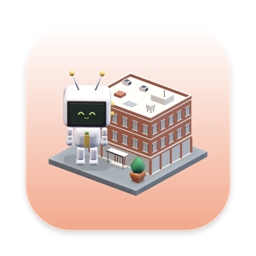
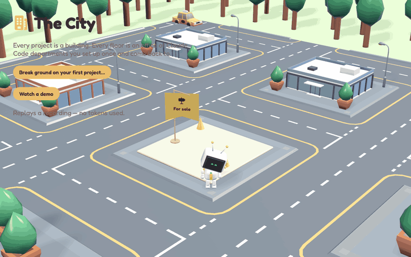
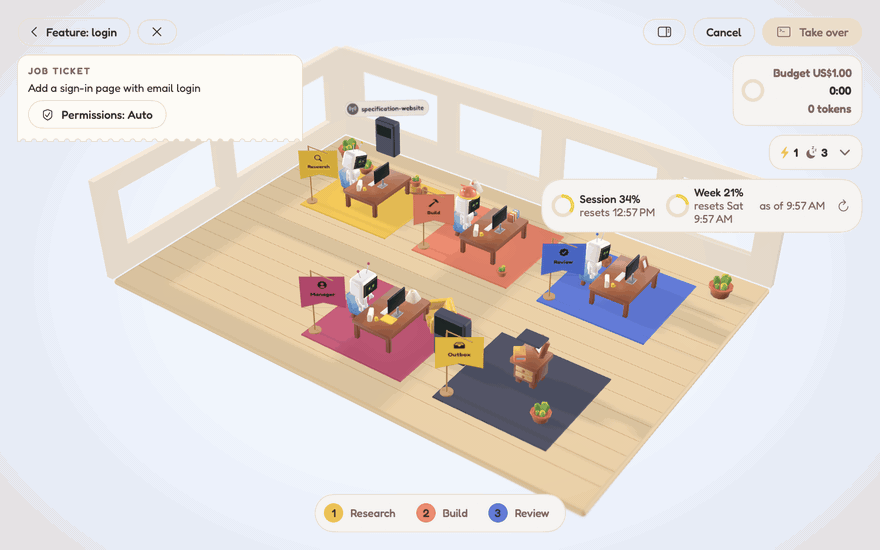

<p align="center"></p>

# The City


A macOS app that shows Claude Code runs as a city of robot-staffed offices. Every project folder is a building, every building has floors of robots, and every animation comes from a real event in the `claude` CLI's stream.

The City starts its own Claude Code runs using the `claude` you already have installed, and they count towards your plan as usual. It doesn't show sessions you started in a terminal.



## Requirements

- macOS 26 or later.
- [Claude Code](https://docs.claude.com/en/docs/claude-code) 2.1.163 or later, installed and signed in. Older versions have known security issues and the app won't run jobs with them. The app looks for `claude` on your `PATH` and in `~/.local/bin`, `/opt/homebrew/bin`, `/usr/local/bin` and `~/.claude/local`. You can also point it at the binary in Settings. Before each job it checks that Claude Code is installed and signed in, and offers Install…, Locate… or Sign In… if not.
- Apple Intelligence enabled, for the on-device model that picks departments and routes work. Without it, choose Claude Haiku under Settings › Reception (it counts towards the account's usage limits). A word-overlap check is used as a fallback.

## Install

1. Download the latest `.dmg` or `.zip` from [Releases](https://github.com/Slaymish/theCity/releases).
2. Drag **TheCity.app** into Applications.
3. The build is not notarised, so macOS blocks the first launch with "Apple could not verify…". Click **Done**, then open **System Settings › Privacy & Security**, scroll down and click **Open Anyway**. Or run:

   ```sh
   xattr -dr com.apple.quarantine /Applications/TheCity.app
   ```

### Updates

The app uses [Sparkle](https://sparkle-project.org) to check for new releases and install them. To check straight away, choose **The City › Check for Updates…**.

## How it works



- **City:** each project folder is a building (File › New Project…, ⇧⌘N). Beacons show which buildings are working or need you, and a "Needs you" list jumps to the waiting floor. ⌘0 returns to the city.
- **Reception:** tell the receptionist what you need. It sends the job to the floor whose team fits, taking into account work already running on other floors, or proposes a new floor. A busy floor queues the job.
- **Hiring:** a new floor's departments are picked from the project's `.claude/agents/*.md`. You can hire or release any of them.
- **Floor:** a saved team (departments, model, budget, allowed services and skills) with its own Claude session and job history. Floors run in parallel.
- **Office:** the floor runs `claude -p` in stream-JSON mode. Subagents work at their department's desk; anything the plan didn't hire sits at the Contractor desk.
- **Questions and approvals** appear as cards at the robot's desk. Use ⌘1–⌘9 to pick an option, ⌘↩ to send or allow, and ⌘⌫ to deny. **Always allow** saves the CLI's suggested rule to the project's `.claude/settings.local.json`.
- **Outbox:** the Delivered card has the summary, every file the run wrote or edited, and a follow-up field that resumes the same session.
- **Plan limits:** 5-hour and weekly usage from the latest job appear top right.
- When the app needs you while it's in the background, it posts a notification and badges the Dock icon.

Settings (⌘,) holds the defaults for new jobs (account, model, budget), the theme, notifications, sounds and the location of `claude`. **View › Show Raw Log** (⌥⌘L) opens the raw CLI stream.

The city is saved in `~/Library/Application Support/The City/`.

## Bugs and ideas

The backlog lives in [GitHub Issues](https://github.com/Slaymish/theCity/issues), so you can see what's planned and what's already known. If something breaks or you have an idea, [open an issue](https://github.com/Slaymish/theCity/issues/new/choose). Rough reports are fine. Issues labelled [good first issue](https://github.com/Slaymish/theCity/labels/good%20first%20issue) are a good place to start contributing. See [CONTRIBUTING.md](CONTRIBUTING.md) for details.

## Building from source

Needs Xcode 27 and [XcodeGen](https://github.com/yonaskolb/XcodeGen) (`brew install xcodegen`).

```sh
make run       # generate the project, build, and open against SampleWorkspace/
make install   # build and copy to /Applications/TheCity.app
make test      # OfficeCore unit tests against fixtures/
make replay    # open and replay fixtures/three-rooms.jsonl (no API calls)
make clean     # remove build output and the generated project
```

### Releasing

CI runs the tests and builds the app on every push and pull request. Pushing a tag such as `v0.2.0` also builds a release with that version and publishes the `.dmg`, `.zip` and Sparkle `appcast.xml` to GitHub Releases, using the tag's section of `CHANGELOG.md` as the notes. Updates are signed with the EdDSA key in the `SPARKLE_ED_PRIVATE_KEY` repository secret, which must match `SUPublicEDKey` in `project.yml`.

In Claude Code, `/release` does the whole thing: it checks `main` is clean and green, writes the CHANGELOG section from what changed since the last tag, then tags, pushes and checks the published release.

`Tools/Dev/readme-gifs.sh` re-renders the GIFs in this README from scripted scenes (needs `make build`, ffmpeg and gifsicle). Pass `showcase`, `city` or `office` to refresh a single reel. `Tools/Dev/readme-icons.sh` regenerates the Mac and iPhone icons from the same scene. See [Media notes](Docs/Media/README.md) for framing, timing and export settings.

`make project` regenerates `TheCity.xcodeproj` from `project.yml` on its own. In debug builds, **Debug › Replay Fixture…** (⇧⌘R) replays any saved stream.

### Layout

- `Packages/OfficeCore`: stream parser, control protocol, reducer, process layer and agent catalogue. No UI imports.
- `App/`: SwiftUI screens, RealityKit scenes, on-device routing and hiring, theme and brands.
- `fixtures/`: recorded CLI streams used by the tests and the replay mode.
- `SampleWorkspace/`: a throwaway project with a few example agents.

### Launch arguments

`-workspace <dir>`, `-request <text>`, `-model <alias>`, `-theme light|dark`, `-replay <file.jsonl>`, `-cli <path>`.

## Credits

The initial concept and visual design were inspired by [AI Office](https://sael.net/ai-office). I wanted to flesh it out into something that fits my own workflow and taste.

3D models are KayKit (CC0), sounds are Kenney (CC0) and lighting uses Poly Haven HDRIs (CC0). Fredoka and Lexend are under the SIL Open Font Licence. See the credit files in `App/`.

## Licence

MIT. See [LICENSE](LICENSE).
